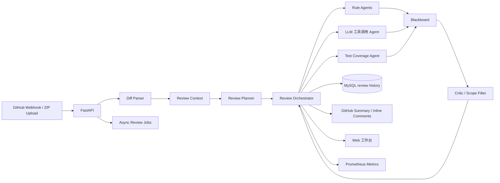

# 架构说明

## 关键设计

- **Diff-aware review**：`diff_parser.py` 解析 unified diff，`review_context.py` 将 changed lines 映射到 `ReviewRequest.files`，让系统知道本次 PR 真正改了哪些位置。
- **Planner-driven orchestration**：`planner.py` 根据改动文件、语言和风险信号生成 Security / Performance / Maintainability / Test Coverage 任务，而不是把所有文件无差别交给所有 Agent。
- **专职 Agent**：规则 Agent 提供稳定兜底，LLM 工具调用 Agent 提供语义审查，Test Coverage Agent 专门识别生产代码变更缺少测试的问题。
- **Blackboard + Critic**：Agent 输出统一 `Finding` schema 写入 Blackboard；`critic.py` 在最终汇总前做 PR 范围校验、误报抑制和置信度保留。
- **GitHub integration**：Webhook 先校验 `X-Hub-Signature-256`；配置 `GITHUB_TOKEN` 后可拉取 PR changed files 并生成 summary / inline comment payload。
- **Async review jobs**：`POST /api/reviews/jobs` 返回 job id，后台线程执行审查，`GET /api/reviews/jobs/{job_id}` 查询 queued/running/completed/failed 状态、事件和报告。

## 生产边界

- PR 评论失败不影响审查记录保存。
- LLM 调用失败不影响规则 Agent 输出。
- 大仓库审查通过 zip/file 限制和 raw file 字符上限控制成本。
- 当前异步任务使用进程内存储，适合演示；生产可替换 Redis/Celery/数据库任务表。
- Critic 默认只保留 changed line 上的 diff finding，偏保守；生产可改为 hunk 上下文窗口策略。
