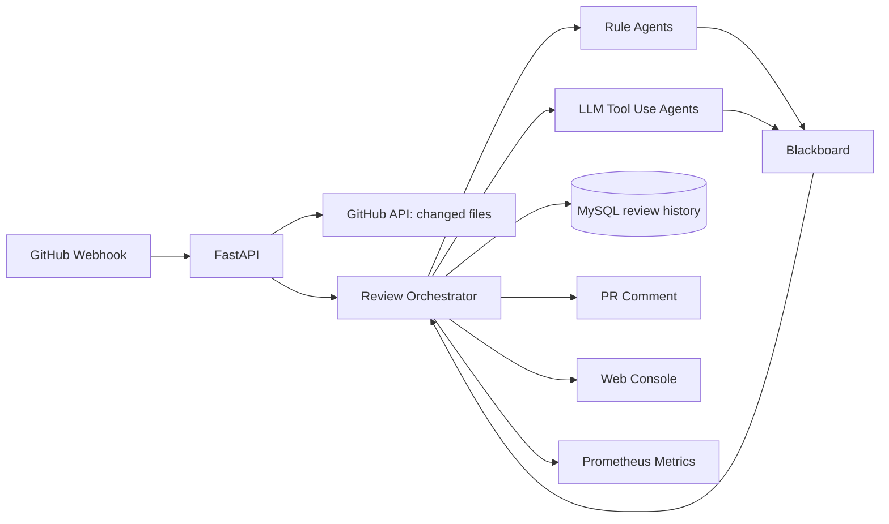

# 架构说明

## 关键设计

- Orchestrator 负责调度、合并、去重、排序和冲突仲裁，不直接做具体审查。
- Agent 输出统一 `Finding` schema，便于排序、展示和 PR 评论。
- 规则 Agent 提供稳定兜底，LLM Tool Use Agent 提供语义审查。
- MessageBus 默认内存实现，可通过 `MESSAGE_BUS_BACKEND=redis` 切到 Redis Stream。

## GitHub 集成

- Webhook 先校验 `X-Hub-Signature-256`。
- payload 带 `review_files` 时直接审查，便于本地测试。
- 配置 `GITHUB_TOKEN` 后，会调用 GitHub API 拉取 PR changed files，并把 Markdown 报告评论回 PR。

## 生产边界

- PR 评论失败不影响审查记录保存。
- LLM 调用失败不影响规则 Agent 输出。
- 大仓库审查通过 zip/file 限制和 raw file 字符上限控制成本。
